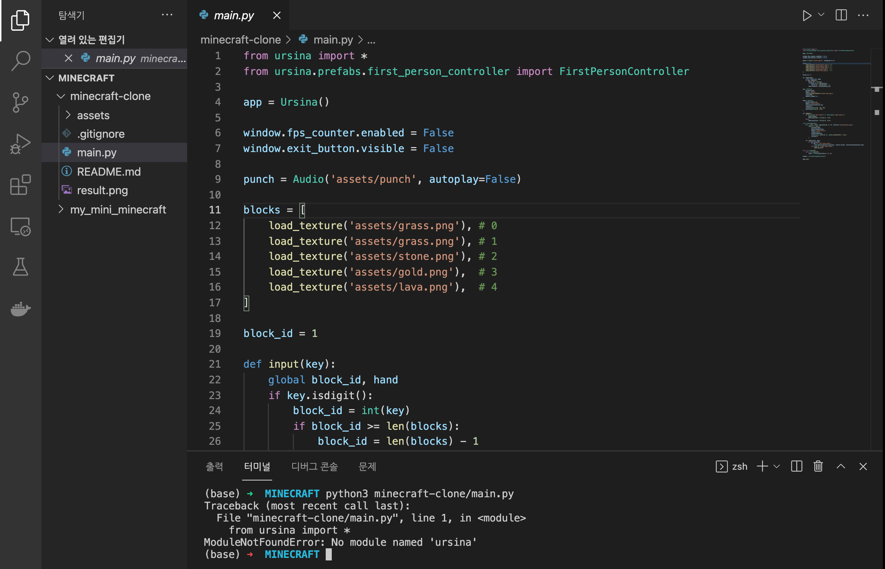
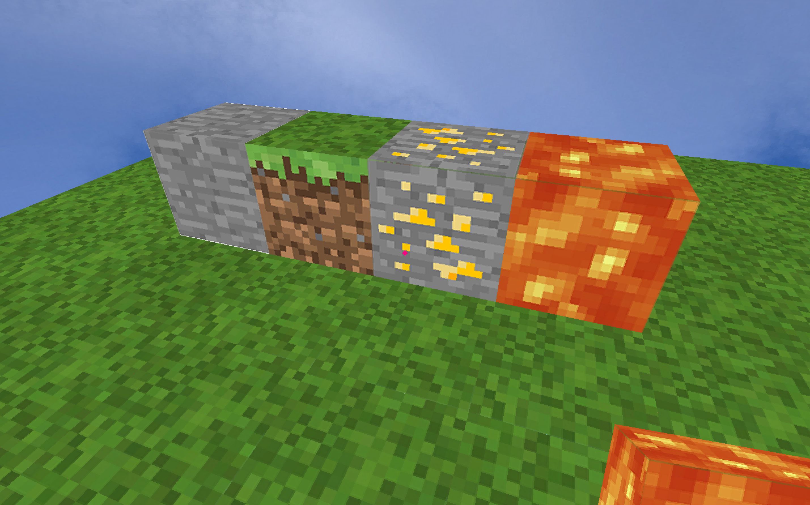

# Mine!Craft

빅데이터냐 네트워크 통신이냐 고민하던 중, 마크 파이썬 80줄로 만들기 영상을 봐버렸다..

이건 못 참지! 하루 이틀이라도 좋으니 해보자! (사실 오늘 국대 축구 있어서 금방하고 축구볼거야)

[참고 영상](https://www.youtube.com/watch?v=EkmFkW03ftE) [github.1](https://github.com/kairess/minecraft-clone/blob/master/main.py) [github.2](https://github.com/pokepetter/ursina/blob/master/samples/minecraft_clone.py)

먼저 위에 github 링크 두개 확인하고, 클론하기! + 내 [레포](https://github.com/huskycat1202/my_mini_minecraft)도 하나 만들어서 올리기!



ursina를 먼저 설치를 해달라고 한다.. 당연하지

```jsx
pip install ursina
```

그런데 pip 관련해서 오류가 생기는데 이게 그 유명하신 BigSur 문제란다...

pip을 한동안 업그레이드 하지 말라는데... 이미 업그레이드했으니.. 없애버리고 다시 깔면된다고 한다!

그럼 유투버의 main.py를 실행해볼까?

```jsx
python3 minecraft-clone/main.py
```



진짜 마인크래프트처럼 다 된다!

다만 용암 이펙트 및 조합된 아이템 없고, 창 밖으로 마우스 컨트롤이 힘들다는 점, 무한의 바닥(?)으로 떨어지면 죽음 판정이 없어 끝없이 떨어져서 강제종료를 해줘야한다는 점 등 단점이 느껴졌다.

이번에 내가 해주고 싶은 부분은 아래 5가지 정도?

1. 자유로운 마우스 컨트롤
(나가기, esc로 다른 윈도우 클릭 가능하게)
2. 죽음 판정 후 부활
3. 월드 넓히기 (가능하면 최대한 넓게)
4. 블록 디자인 추가
5. 알파벳 블록 제작해 워드퍼즐 게임으로 활용

그럼 이제 내 폴더로 옮겨서 코드를 한땀한땀 뿌셔먹어보겠다!

1. 1인칭 시점 컨트롤러 import

    ```python
    from ursina.prefabs.first_person_controller import FirstPersonController
    ```

2. `window.exit_button.visible`

    window에서 나가기 버튼을 만들어주는 변수인가 보다. 무조건  True를 해줬다.

    

    답도 없다.. 왜그런지 이유를 찾아보니 main.py만 복붙한거라... 필요한 모든 이미지 파일이 없으니 새하얀 화면일 수 밖에..

    아쉽게 이미지 파일들은 올려주시진 못했다.. 유료니까..!
